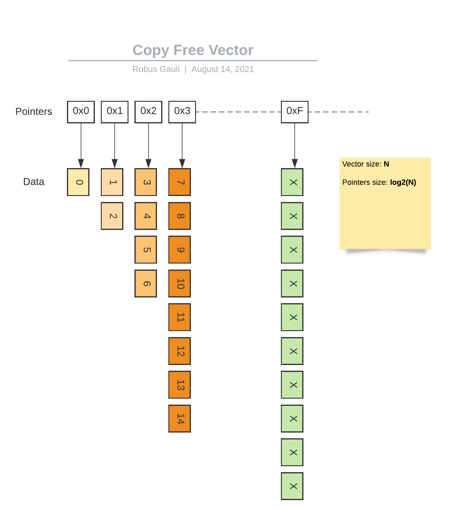

# cvector(1) | zero(1)

  Generic vector implementation with iterator helper in C. Also included <b>copy free</b> implemenation of vector.

`zero.h` uses copy free allocator i.e there is no copy when size exceeds capacity.

## Copy Free Vector Representation (zero.h)


***

## Installation

  It has a two header files file called `cvector.h` and `zero.h`. You can simply copy/paste in your source directory to get started. You can also install via clib (package manager for C).

  With [clib](https://github.com/clibs/clib):
  ```sh
  clib install robusgauli/cvector
  ```


## About

Vector/List is fundamental data structure for just about anything. Therefore, I wanted something similar to what we have in other languages in C. Also, it includes `iterator` for free which allows you to do pretty interesting stuff such as peek, next, done, etc.

Go to [cvector.h](https://github.com/RobusGauli/cvector/blob/master/src/cvector.h) and [zero.h](https://github.com/RobusGauli/cvector/blob/master/src/zero.h) for complete list of APIs.

## Usage

### Simple example
```c
#include "cvector.h"

int main() {
  // Define type that holds vector of int
  Vector(int) vector_int_t;

  // Declare variable of type `vector_int_t`
  vector_int_t vector_int;

  // Initialize
  vector__init(&vector_int);

  // Push number to vector
  for (int i = 0; i < 100; i++) {
    vector__add(&vector_int, i);
  }

  // Size of the vector
  size_t size = vector__size(&vector_int);

  // Iterate over elements
  for (int i = 0; i < 100; i++) {
    int* number = vector__index(&vector_int, i);
    printf("Number is: %d\n", *number);
  }
}
```

### Example using copy free vector

```c
#include "zero.h"

int main() {
  // Define zero type of int
  Zero(int) zero_int_t;

  // Declare variable of type `zero_int_t`
  zero_int_t zero_int;

  // Initialize
  zero__init(&zero_int);

  // Push elements to vector
  for (int i = 0; i < 100; i++) {
    zero__add(&zero_int, i*i);
  }

  // Size of zero vector
  size_t size = zero__size(&zero_int);

  // Iterate over vector
  for (int i = 0; i < size; i++) {
    int* number = zero__index(&zero_int, i);
    printf("Number at index: %d is %d\n", i, *number);
  }
}
```

### With Iterator

NOTE: Iterator is not available for copy free implementation.
```c
#include "cvector.h"

// Define zero type of int
Vector(int) vector_int_t;


// Define iterator type for iterator_int_t
Vector_iterator(vector_int_t) iterator_int_t;

int main() {

  // Declare variable of type `zero_int_t`
  vector_int_t vector_int;

  // Initialize
  vector__init(&vector_int);

  // Push elements to vector
  for (int i = 0; i < 10; i++) {
    vector__add(&vector_int, i*i);
  }

  // Declare varaible of type `iterator_int_t`
  iterator_int_t iterator_int;

  // Initialize iterator with vector of int
  vector_iterator__init(&iterator_int, &vector_int);

  // Peek the current element
  int* number = vector_iterator__peek(&iterator_int);
  printf("The peeked number is: %d\n", *number);

  // Iterate using iterator
  for (;;) {
    if (vector_iterator__done(&iterator_int)) {
      break;
    }

    int* number = vector_iterator__next(&iterator_int);
    printf("Got number: %d\n", *number);
  }
}
```

### Using struct
```c
#include "cvector.h"

typedef struct Node_t {
  int x;
  int y;
} Node_t;

int main() {
  // Define vector type of `Node_t`
  Vector(Node_t) vector_node_t;

  // Declare variable of type `vector_node_t`
  vector_node_t vector_node;

  // Initialize vector
  vector__init(&vector_node);

  // Push to vector
  for (int i = 0; i < 100; i++) {
    Node_t node = ((Node_t){.x = i, .y = i*i});
    vector__add(&vector_node, node);
  }

  // Define iterator of type `vector_node_t`
  Vector_iterator(vector_node_t) iterator_node_t;

  // Declare variable of type `iterator_node_t`
  iterator_node_t iterator_node;

  // Initialize iterator
  vector_iterator__init(&iterator_node, &vector_node);

  // Iterate
  for(;;) {
    if (vector_iterator__done(&iterator_node)) {
      break;
    }

    Node_t* node = vector_iterator__next(&iterator_node);
    printf("Node: x -> %d & y -> %d\n", node -> x, node -> y);
  }
}
```

### More APIs (cvector.h)

```c
#include <cvector.h>

int main() {
  Vector(int) vector_int_t;
  vector_int_t vector_int;

  vector__init(&vector_int);

  vector__add(&vector_int, 12);
  vector__add(&vector_int, 13);
  vector__add(&vector_int, 14);
  vector__add(&vector_int, 15);

  {
    // Get the first element
    int* number = vector__first(&vector_int);
    printf("First element: %d\n", *number);
  }

  {
    // Get the last element by copy
    int number = vector__last_cpy(&vector_int);
    printf("Last element: %d\n", number);
  }

  {
    size_t size_before = vector__size(&vector_int);

    printf("Size of vector before pop: %ld\n", size_before);

    // Pop element from the vector
    int* number = vector__pop(&vector_int);

    printf("Popped element: %d\n", *number);

    size_t size_after = vector__size(&vector_int);
    printf("Size of vector after pop: %ld\n", size_after);
  }
}
```

### More APIs (zero.h)

```c
#include <cvector.h>

int main() {
  Zero(int) zero_int_t;
  zero_int_t zero_int;

  zero__init(&zero_int);

  zero__add(&zero_int, 12);
  zero__add(&zero_int, 13);
  zero__add(&zero_int, 14);
  zero__add(&zero_int, 15);

  {
    // Get the first element by copy
    int number = zero__first_cpy(&zero_int);
    printf("First element: %d\n", number);
  }

  {
    // Get the last element by copy
    int number = zero__last_cpy(&zero_int);
    printf("Last element: %d\n", number);
  }
}
```
